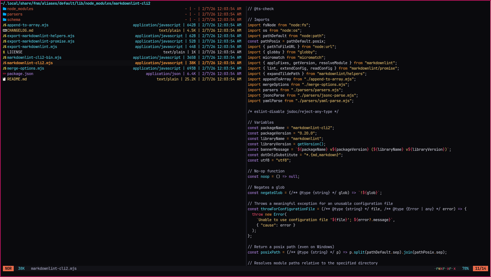

<div align="center">
  
</div>

<h3 align="center">
 Obsidian-Glow Flavor for <a href="https://github.com/sxyazi/yazi">Yazi</a>
</h3>

## 👀 Preview



## 🎨 Installation

```sh
ya pkg add ZimCodes/yazi-flavors:obsidian-glow
```

## ⚙️ Usage

To set it as your dark flavor, change the content of your `theme.toml` to:

```toml
[flavor]
dark = "obsidian-glow"
```

Make sure your `theme.toml` doesn't contain anything other than `[flavor]`, unless you want to override certain styles of this flavor.

See the [Yazi flavor documentation](https://yazi-rs.github.io/docs/flavors/overview) for more details.

## 📜 License

The flavor and tmTheme file are both licensed under MIT.

See [LICENSE](LICENSE) and [LICENSE-tmtheme](LICENSE-tmtheme) file for more details.
